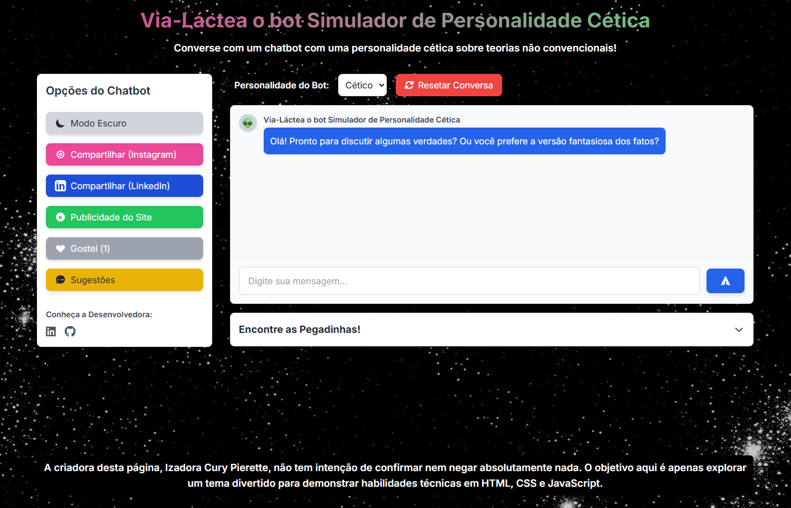
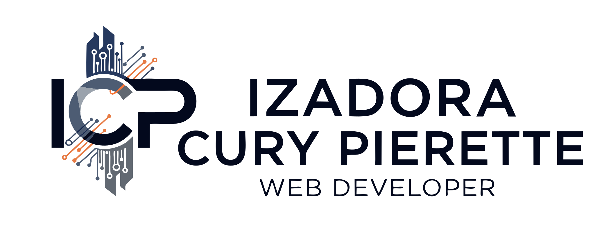

# 🤖 Chatbot Cético — Via-Láctea, o Bot de Personalidade Sarcástica 👽

**Criado por [Izadora Cury Pierette](https://www.linkedin.com/in/izadora-cury-pierette-7a7754253/)**  
Projeto desenvolvido com HTML, CSS (Tailwind + custom), e JavaScript puro.

## 📌 Descrição

O **Chatbot Cético** é um simulador de conversa com um bot sarcástico que rebate teorias não convencionais com respostas céticas, irônicas e personalizadas. Além de uma interface divertida e responsiva, o projeto oferece múltiplas funcionalidades interativas, ideal para demonstrar habilidades em front-end moderno.

> 💡 **Destaque:** desbloqueie diferentes personalidades do bot (entediado, filósofo, sem-graça) ao interagir com palavras-chave específicas!

---

## 🎯 Funcionalidades Principais

- 🧠 **Personalidade Cética** com respostas irônicas baseadas em palavras-chave.
- 👻 **Efeitos especiais** e transições para diferentes “pegadinhas” ativadas por interação.
- 🎭 **Alterações dinâmicas de personalidade** com avatar e estilo distintos.
- 🌗 **Modo claro/escuro** com persistência no `localStorage`.
- 💬 **Chat interativo** com animação de digitação, bolhas customizadas e rolagem suave.
- 📲 **Compartilhamento direto** para Instagram e LinkedIn com geração automática de texto.
- 📢 **Modal de publicidade** com texto pronto para divulgar o projeto.
- ❤️ **Botão de Like persistente** com contagem armazenada no navegador.
- 💡 **Formulário de sugestões** funcional via [Formspree](https://formspree.io/).
- 📸 **Geração de GIFs** (estrutura preparada para integração com `html2canvas` + `gif.js`).

---

## 🧪 Tecnologias Utilizadas

- **HTML5 Semântico**
- **CSS3 + Tailwind CSS**
- **JavaScript Vanilla (ES6+)**
- **Font Awesome**
- **Formspree (sugestões)**
- **html2canvas & gif.js (pré-integrados)**

---

## 📂 Estrutura de Pastas

```
📦 chatbot-cetico/
├── index.html
├── script.js
├── src/
│   ├── css/
│   │   └── style.css
│   ├── images/
│   │   ├── fundo.png
│   │   ├── imagem-estatica.png
│   │   └── pegadinha-[tipo].gif
```

---

## 🖼️ Preview

> 💻 Versão Desktop | 📱 Totalmente Responsivo  



---

## 🚀 Como Executar Localmente

1. Clone este repositório:
   ```bash
   git clone https://github.com/ipierette/chat-bot-via-lactea
   cd chatbot-cetico
   ```

2. Abra o arquivo `index.html` no navegador:
   ```bash
   open index.html
   ```

---

## 📢 Como Divulgar

Compartilhe esse chatbot com o texto gerado no botão “Publicidade do Site” ou utilize o recurso de compartilhamento direto para Instagram e LinkedIn.

---

## ✍️ Sugestões?

Você pode enviar sugestões diretamente pelo modal “Sugestões” no site. As mensagens são enviadas via [Formspree](https://formspree.io/) para testes sem back-end.

---

## 🧠 Conceitos Aplicados

- Manipulação dinâmica de DOM
- Controle de estado em JavaScript
- Efeitos visuais e animações CSS customizadas
- Design responsivo e acessível
- Armazenamento local com `localStorage`
- Compartilhamento para redes sociais

---

## 📃 Licença

Este projeto é de uso livre para fins educacionais e de portfólio. Créditos obrigatórios à autora original em versões derivadas.


## 🧠 Maiores Desafios e Como Resolvi

### 1. Bot com Personalidade Dinâmica
Criei um sistema de palavras-chave para alternar a personalidade do bot e gerar respostas irônicas personalizadas.

### 2. Transições Visuais e Pegadinhas
Implementei efeitos visuais com CSS e JavaScript (glitch, fade, pulse) para marcar as trocas de personalidade.

### 3. Rolagem Suave e Layout Fixo
Utilizei `height: 60vh` e `overflow-y: auto` para manter o chat fixo e fluido, com rolagem automática.

### 4. Alternância de Tema (Dark/Light)
Implementei modo escuro/claro com classes CSS dinâmicas e `localStorage` para salvar a preferência.

### 5. Likes Persistentes
Usei `localStorage` para manter o número de likes e evitar múltiplos votos.

### 6. Compartilhamento Inteligente
Criei textos dinâmicos para Instagram/LinkedIn com cópia automática e abertura de janelas de compartilhamento.

### 7. Código Limpo e Escalável
Organizei o JavaScript em funções separadas, com nomes descritivos e comentários explicativos.

### 8. Estrutura para Geração de GIFs
Preparei a base com `html2canvas` e `gif.js` para permitir geração de conteúdo visual no futuro.

---

## 🙋‍♀️ Desenvolvido por

**Izadora Cury Pierette**  
🔗 [LinkedIn](https://www.linkedin.com/in/izadora-cury-pierette-7a7754253/)  
💻 [GitHub](https://github.com/ipierette)



---
